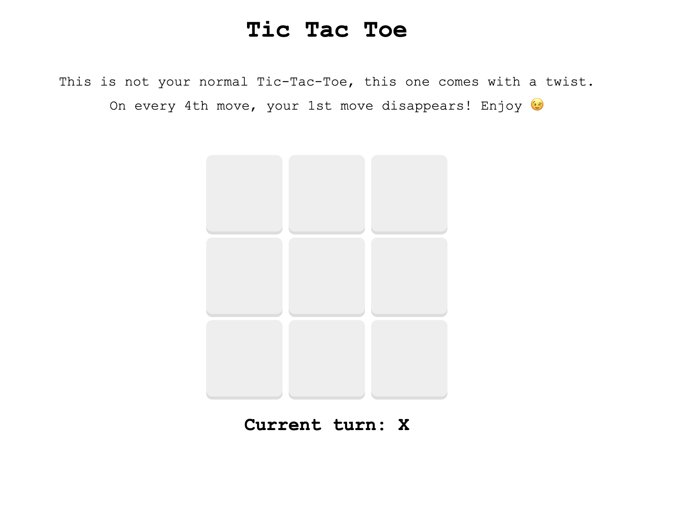
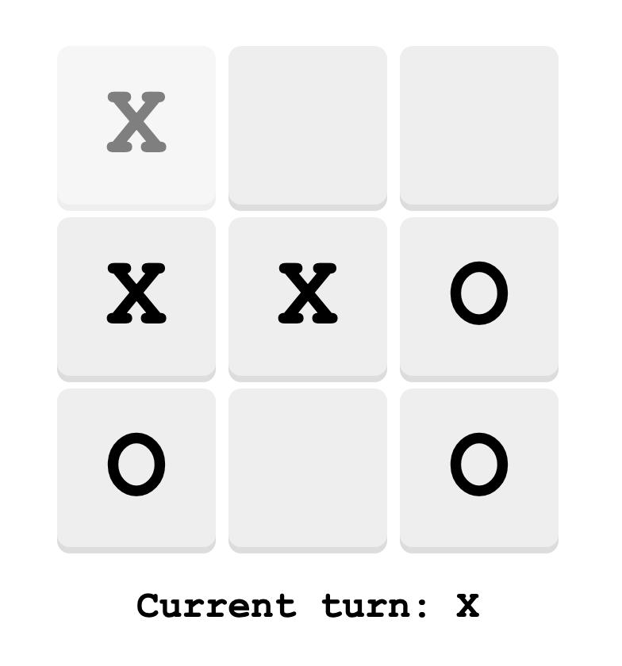
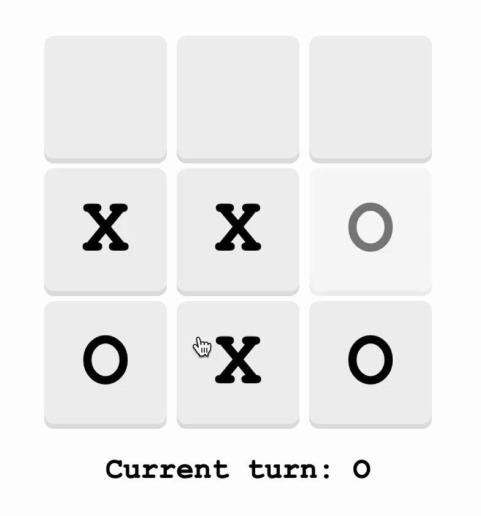

# 🎮 Tic-Tac-Toe V2 - The Disappearing Moves Edition

A unique twist on the classic Tic-Tac-Toe game where every 4th move causes your first move to disappear! Built with Next.js and React.

## Game Concept

This isn't your ordinary Tic-Tac-Toe! The game introduces an innovative mechanic that adds strategic depth:

- **Classic 3x3 grid**: Standard Tic-Tac-Toe setup
- **The disappearing twist**: On every 4th move, your very first move vanishes from the board
- **Strategic gameplay**: Players must think ahead, knowing their earliest moves won't last
- **Dynamic board**: The game state constantly evolves as moves disappear

## 🎨 Screenshots

### Home Page



### Vanishing Move in Action



### Gameplay Demo



## How to Play

1. **Take Turns**: Players alternate placing X's and O's on the 3x3 grid
2. **Watch for Disappearing Moves**: After 4 moves, the first move of the current player disappears
3. **Plan Strategically**: Consider which moves to make, knowing they'll eventually vanish
4. **Win Conditions**: Get three of your symbols in a row (horizontal, vertical, or diagonal)

## 🚀 Live Demo

[Play the game here!](https://vanishing-tictactoe.vercel.app/)

## 🛠️ Built With

- **Next.js 12.1.0** - React framework for production
- **React 17.0.2** - UI library
- **CSS3** - Styling and animations
- **JavaScript ES6+** - Game logic and state management

## Key Features

- **Responsive Design**: Works on desktop and mobile devices
- **Visual Feedback**:
  - Winning combinations highlighted in aquamarine
  - Next-to-disappear moves shown with 50% opacity
  - Smooth animations and transitions
- **Game State Management**: Clean separation of concerns with custom hooks
- **Modular Architecture**: Reusable components and utilities

## 🚀 Getting Started

### Prerequisites

- Node.js 14+
- npm or yarn

### Installation

1. **Clone the repository**

   ```bash
   git clone https://github.com/yourusername/tic-tac-toe-v2.git
   cd tic-tac-toe-v2
   ```

2. **Install dependencies**

   ```bash
   npm install
   ```

3. **Run the development server**

   ```bash
   npm run dev
   ```

4. **Open your browser**
   Navigate to [http://localhost:3000](http://localhost:3000)

## 🎮 Game Mechanics

### Disappearing Moves Logic

- **First X Disappears**: When O makes their 3rd move, X's first move is marked to disappear
- **Queue Management**: Each player's moves are tracked in separate queues
- **Automatic Removal**: On the 4th move, the oldest move is automatically removed
- **Visual Indicators**: Players can see which move will disappear next

### Win Detection

- Checks all 8 possible winning combinations after each move
- Highlights winning squares when a player wins
- Prevents further moves after a win

---

**Enjoy the game! 🎮✨**
